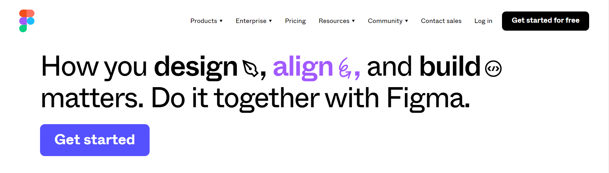
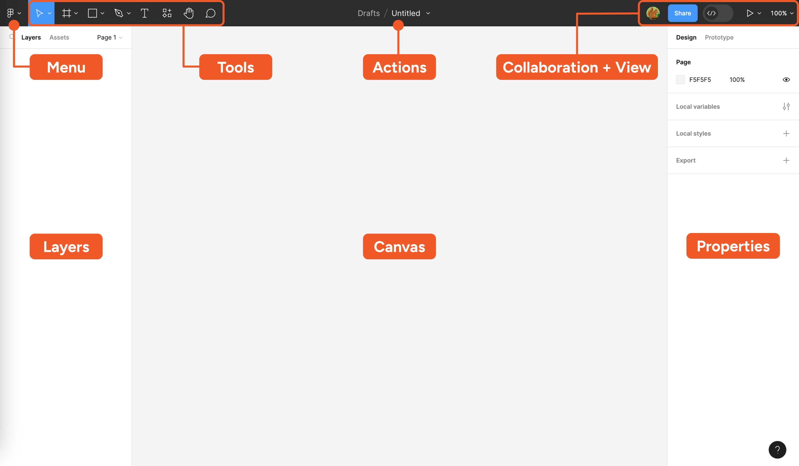
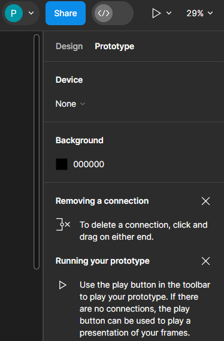
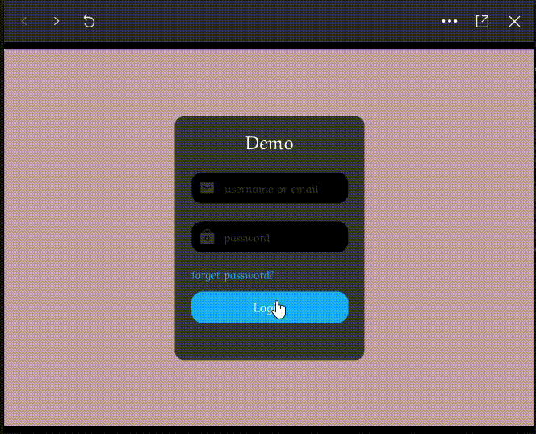

# Figma

Figma is a cloud-based design and prototyping tool used for interface design, user experience (UX) design, and collaboration in the field of web and app development. It enables designers to create, share, and collaborate on digital designs in real-time, making it particularly useful for teams working remotely or across different locations.

## Table of Contents

* [**Introduction**](#introduction)
* [**Setting Up Figma**](#setting-up-figma)
* [**Basic Design Concepts**](#basic-design-concepts)
* [**Organizing Your Design**](#organizing-your-design)
* [**Prototyping**](#prototyping)
* [**Collaboration Features**](#collaboration-features)
* [**Advanced Features**](#advanced-features)
* **Reference**

## **Introduction**

* [**Introduction to Figma**](#introduction-to-figma)
* [**Brief overview of the importance of Figma in design and collaboration**](#brief-overview-of-the-importance-of-figma-in-design-and-collaboration)

### **Introduction to Figma**

* Figma is a powerful cloud-based design and prototyping tool used in the field of UI/UX design, allowing for the creation of digital interfaces and interactive prototypes.

**Key Features:**

* **Real-time Collaboration:** Figma's cloud-based nature enables multiple users to work on the same project simultaneously, fostering seamless collaboration.
* **Accessibility:** As a web-based tool, Figma is accessible from any device with an internet connection, eliminating the need for manual file transfers.
* **Vector Editing:** Figma provides robust vector editing capabilities, allowing for the creation and manipulation of scalable graphics.

### **Importance of Figma in design and collaboration**

1. **Collaboration Efficiency:** Figma facilitates real-time collaboration, enabling designers and teams to work together irrespective of geographical locations. This results in increased efficiency and faster project timelines.

2. **Accessibility and Flexibility:** The cloud-based nature of Figma ensures that design files are easily accessible, providing flexibility for designers to work from different devices and locations.

3. **Seamless Workflow:** Figma supports a seamless design workflow from conception to implementation, incorporating features for design, prototyping, collaboration, and developer handoff all within one platform.

4. **Design Consistency:** Figma's components and styles system helps maintain design consistency across different parts of a project, ensuring a cohesive and professional look and feel.

5. **Prototyping Capabilities:** Figma's prototyping features allow designers to create interactive prototypes, providing a more immersive preview of the user experience and helping in user testing.

6. **Developer Collaboration:** Figma facilitates communication between designers and developers through its developer handoff features, ensuring a smoother transition from design to code.

## **Setting Up Figma**

* [**Creating an Account**](#creating-an-account)
* [**Exploring the Dashboard**](#exploring-the-dashboard)

### **Creating an Account**

**1. Sign-up Process:**

* To get started with Figma, you need to create an account.
* Visit the Figma website (https://www.figma.com/) and click on "Sign Up" or "Get Started."
* You can sign up using your email address or with a Google account.

**2. Account Setup:**

* After entering your details, follow the account setup process.
* Choose a strong and secure password.
* Confirm your email address through the verification link sent to your email.

**3. Free and Paid Plans:**

* Figma offers both free and paid plans.
* The free plan provides essential features, while the paid plans offer advanced features, team collaboration, and increased storage.

**4. Team Collaboration:**

* If you're working in a team, consider creating or joining a team within Figma during the sign-up process.

### **Exploring the Dashboard**

**Menu:**

* **File Menu:**

  * Access options for creating new files, opening existing ones, and importing projects.
  * Explore the "Recent" section for quick access to your recent projects.

* **Edit Menu:**

  * Contains standard editing options such as Undo, Redo, Cut, Copy, Paste, and more.

* **View Menu:**

  * Adjust the view settings, including zooming in and out, toggling grid visibility, and changing the canvas background color.

* **Help Menu:**

  * Access support resources, keyboard shortcuts, and provide feedback to Figma.

**Tools:**

* **Toolbar:**

  * Houses various tools for drawing, editing, and managing design elements.
  * Common tools include the selection tool, frame tool, shape tools, text tool, and pen tool.
  * Familiarize yourself with each tool's functionality and shortcuts.

**Canvas:**

* **Main Workspace:**

  * The central area where you create and design your projects.
  * Place frames, elements, and design components on the canvas.
  * Zoom in and out to work on specific details or view the entire project.

**Actions:**

* **Interactive Prototyping:**

  * Utilize the "Prototype" tab for creating interactive links between frames.
  * Define interactions such as clicks or drags to simulate user flow.

**Layers:**

* **Layers Panel:**

  * Displays all the layers in your design.
  * Organize layers by grouping and naming them for better organization.
  * Adjust the stacking order of layers.

**Collaboration and Views:**

* **Collaboration:**

  * Access collaboration features such as inviting team members and working in real-time.
  * Use the "Share" button to generate shareable links for viewing or editing permissions.

* **Views:**

  * Explore different views, including the "Prototype" view for interactive prototyping and the "Code" view for developer handoff.

**Properties:**

* **Properties Panel:**

  * Shows properties of the selected object.
  * Adjust details such as color, size, typography, and effects.
  * Explore the "Design" and "Prototype" tabs for specific property adjustments.

## **Basic Design Concepts**

* [**Frames**](#frames)
* [**Adding Elements**](#adding-elements)
* [**Editing and Styling**](#editing-and-styling)

### **Frames**

Frames in Figma are containers that hold your design elements. They define the boundaries of your design and can be used to organize content.

**Creating Frames:**

* Select the "Frame" tool in the toolbar.
* Click and drag on the canvas to create a frame.
* Frames can be resized and repositioned as needed

### **Adding Elements**

**Shapes:**

* Use the shape tools in the toolbar to add basic elements such as rectangles, circles, triangles, etc.
* Click on a shape tool, then click and drag on the canvas to draw the shape.

**Importing Assets:**

* Import images, icons, and other assets by dragging them directly onto the canvas or using the "Import" option in the menu.
* Supported file formats include PNG, JPEG, SVG, and others.

### **Editing and Styling**

**Selecting Objects:**

* Use the selection tool in the toolbar to click on and select objects on the canvas.
* Hold down "Shift" to select multiple objects.

**Editing Objects:**

* Double-click on an object to enter editing mode. For text, double-click to edit the text directly.
* Use the handles to resize, and drag to reposition objects.

**Styling Objects:**

* Customize the appearance of objects in the "Properties" panel.
* Adjust properties such as fill color, stroke, opacity, and more.

**Text Editing:**

* Use the text tool to add and edit text.
* Customize text properties such as font, size, color, and alignment in the "Properties" panel.

## **Organizing Your Design**

* **Layers Organization**
* **Using Components**

### **Layers Organization**

**Layers Panel:**

* The Layers Panel is your key tool for managing and organizing design elements.
* It displays a hierarchical view of all layers in your design, including frames, shapes, and text.

**Grouping Layers:**

* Select multiple layers by holding down "Shift" and clicking.
* Right-click and choose "Group Selection" or use the shortcut "Cmd/Ctrl + G" to group selected layers.
* Grouping helps keep related elements together and makes the Layers Panel more organized.

**Renaming Layers:**

* Double-click on a layer's name to rename it for better clarity.
* Descriptive names make it easier to identify and manage layers.

**Adjusting Stacking Order:**

* Drag layers up or down in the Layers Panel to change their stacking order.
* The order affects how layers overlap on the canvas.

### **Using Components**

**Introduction to Components:**

* Components are reusable design elements that maintain consistency across your project.
* Create components from any object or group by selecting and clicking "Create Component" in the toolbar or right-click menu.

**Instances of Components:**

* Drag and drop a component from the Assets Panel to create instances.
* Instances are duplicates linked to the original component. Editing the component updates all its instances.

**Component Variants:**

* Create component variants for different states or styles by using the "Create Variant" option.
* Manage variants in the "Properties" panel.

## **Prototyping**
  
* [**Prototype Tab**](#prototype-tab)  
* [**Creating Links**](#creating-links)
* [**Previewing Prototypes**](#previewing-prototypes)

### **Prototype Tab**

* The Prototype Tab in Figma allows you to add interactivity to your designs, creating a more dynamic and user-friendly experience.
* Switch to the Prototype Tab located in the upper-left corner of the Figma interface.

### **Creating Links**

**Adding Interactions:**

* Select an object (e.g., button, icon) on the canvas.
* Drag the arrow icon (connection point) that appears to another frame on the canvas to create a link.

**Defining Interactions:**

* Double-click on the connection arrow to open the Interaction Details panel.
* Define the interaction type (e.g., On Click, On Hover) and choose the destination frame.
* Set additional properties like animation and easing.

### **Previewing Prototypes**

**Preview Mode:**

* Click on the "Present" button in the top-right corner to enter the preview mode.
* This mode allows you to interact with your design as users would.

**Navigating Prototypes:**

* Interact with linked objects to navigate between frames.
* Test interactions, transitions, and animations.

## **Collaboration Features**
  
* [**Team Collaboration**](#team-collaboration) 
* [**Comments**](#comments)

### **Team Collaboration** 

**Inviting Team Members:**

* Click on the "Invite to Team" button in the top-right corner to add team members.
* Enter email addresses or invite collaborators directly from the design file.

**Real-time Collaboration:**

* Multiple team members can work on the same project simultaneously in real-time.
* Changes made by one user are instantly reflected for others, fostering efficient collaboration.

### **Comments**

**Adding Comments:**

* Select an object or area on the canvas.
* Click on the comment icon in the toolbar or use the shortcut "R" to open the comment mode.
* Click on the canvas to add a comment related to the selected area or object.

**Resolving Comments:**

* Once a comment is addressed or resolved, click on the "Resolve" button within the comment thread.
* Resolved comments are archived but can be revisited for reference.

**Notification and Replies:**

* Collaborators receive notifications when comments are added or resolved.
* Respond to comments by replying within the comment thread.

## **Advanced Features**

* [**Version History**](#version-history) 
* [**Plugins**](#plugins)

### **Version History** 

**Accessing Version History:**

* Click on the "File" menu and select "Version History."
* View a list of saved versions of your design file.

**Reviewing Versions:**

* Each version includes a timestamp and a brief description of changes made.
* Click on a version to preview and compare with the current state.

**Restoring Versions:**

* To revert to a previous version, select it and click "Restore."
* Restoring a version does not delete the current file; it creates a new version.

### **Plugins**

**Accessing Plugins:**

* Click on the "Plugins" menu to explore and manage plugins.
* Visit the Figma Community to discover a wide range of available plugins.

**Installing Plugins:**

* Browse the plugin directory, click on a plugin, and select "Install" to add it to your Figma workspace.
* Installed plugins appear in the "Plugins" menu.

**Using Plugins:**

* Plugins enhance Figma's functionality by adding features and integrations.
* Some plugins automate tasks, provide design assets, or offer design assistance.

**Developing Custom Plugins:**

* For advanced users, Figma supports the development of custom plugins using JavaScript.
* Visit the Figma Plugin API documentation for information on creating your plugins.